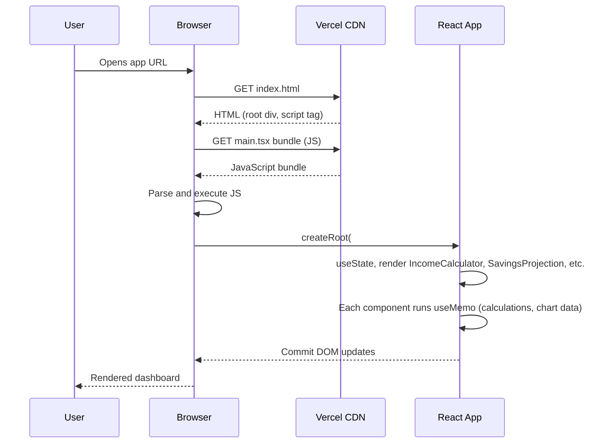
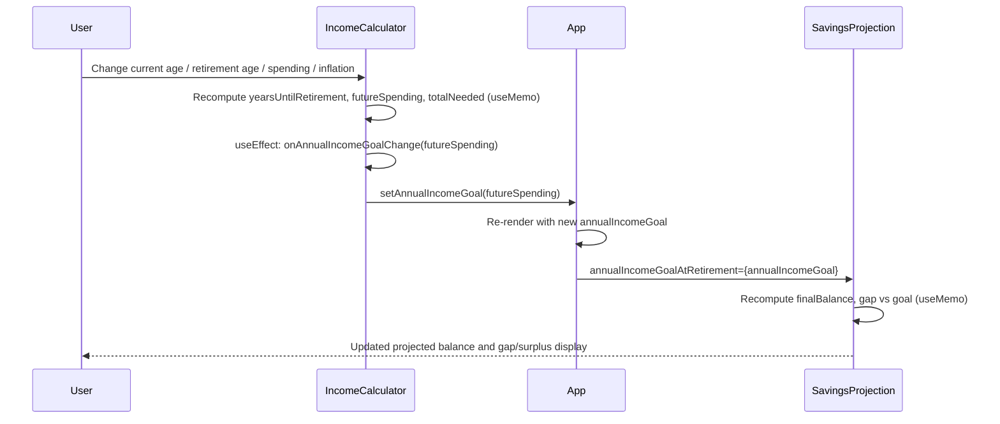
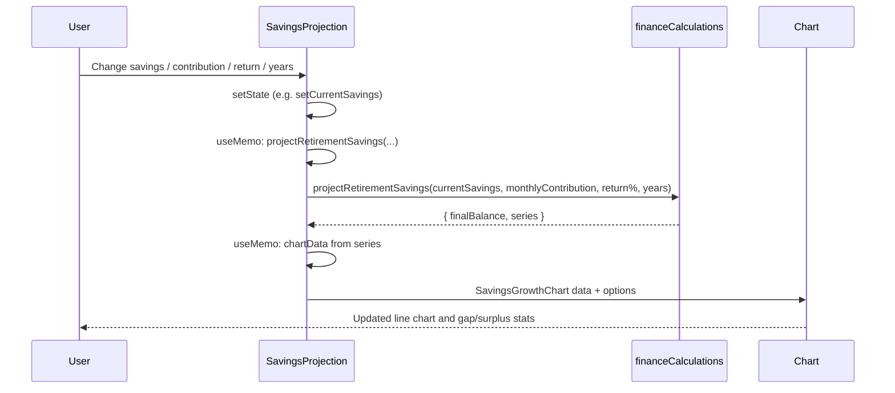
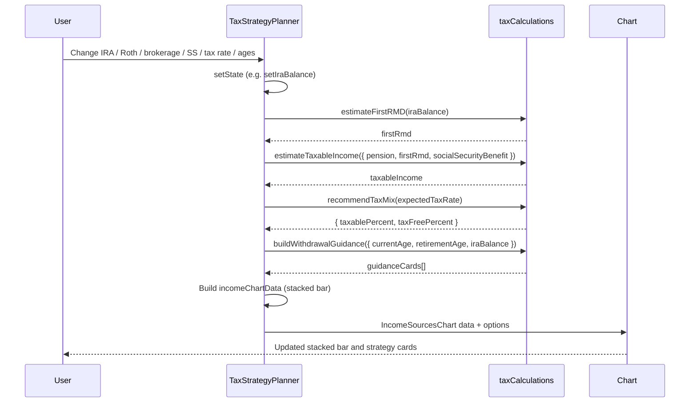
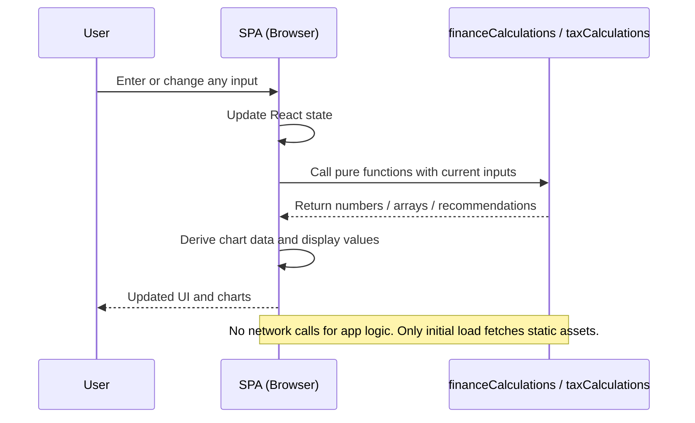

# Sequence Diagrams

The following diagrams use [Mermaid](https://mermaid.js.org/) syntax. They render automatically on GitHub and in many Markdown viewers.

---

## 1. Application Bootstrap

How the app loads from the initial HTML request to the first paint.



---

## 2. User Updates Income Inputs → Goal Flows to Savings

When the user changes inputs in the Income Calculator, the annual goal is propagated to the Savings Projection so the gap/surplus can be shown.



---

## 3. User Updates Savings Inputs → Chart and Gap Update

When the user changes current savings, monthly contribution, return, or years in the Savings Projection section.



---

## 4. Tax Strategy: Inputs → RMD, Taxable Income, and Guidance

When the user changes IRA balance, SS benefit, tax rate, or ages in the Tax Strategy section.



---

## 5. Allocation Sliders → Pie Chart

When the user adjusts any of the five allocation sliders.

```mermaid
sequenceDiagram
    participant User
    participant AllocationPlanner
    participant Chart

    User->>AllocationPlanner: Move slider (e.g. Stocks 50% → 55%)
    AllocationPlanner->>AllocationPlanner: handleSliderChange(key, value) → setAllocations
    AllocationPlanner->>AllocationPlanner: useMemo: total, remaining; chartData from allocations
    AllocationPlanner->>Chart: AllocationPieChart data + options
    Chart-->>User: Updated pie chart and "Total: X%" / allocation message
```

---

## 6. End-to-End: No Backend

Emphasizes that all computation stays in the browser.


